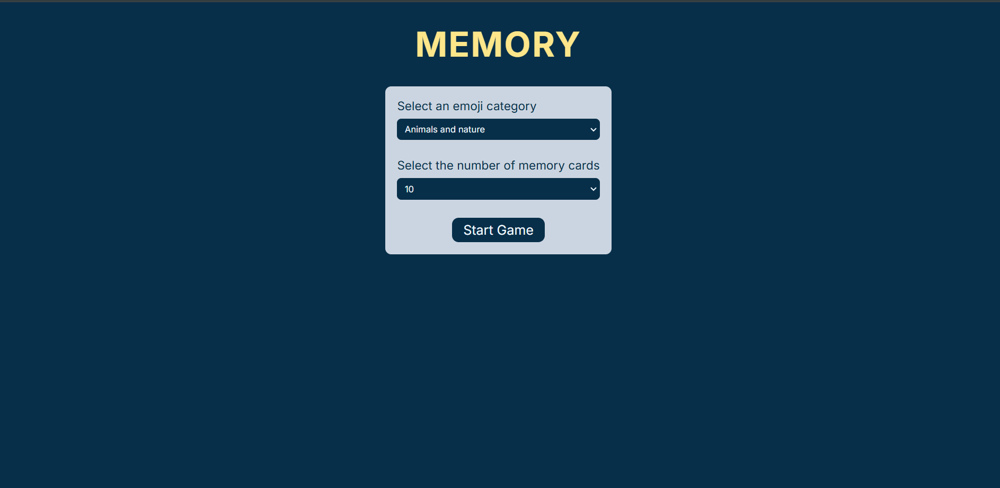
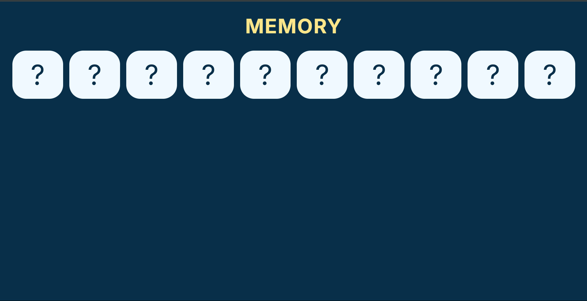
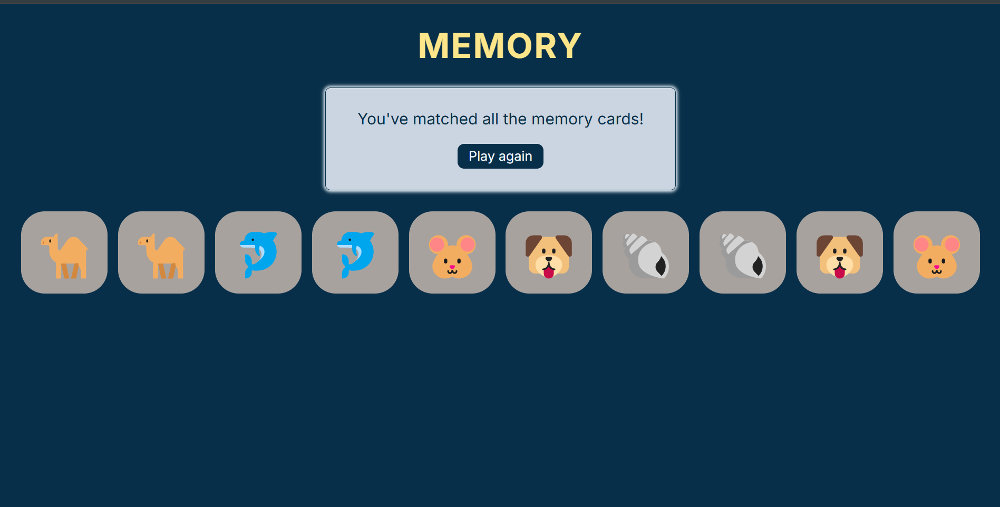

# 🧠 Memory Game - Emoji Matcher 🎉

Welcome to the **Emoji Memory Game**, a fun and interactive game to test and improve your memory skills! Match all the emoji pairs and challenge yourself to beat your best time! 🚀

---

## 🌟 Features

- **Dynamic Gameplay**: Each round randomizes the emoji grid for a fresh challenge.
- **Responsive Design**: Optimized for desktop, tablet, and mobile devices.
- **Interactive UI**: Smooth animations and transitions for a delightful user experience.
- **Score Tracker**: Keep track of your moves and time taken to complete the game.
- **Customizable Themes**: Light and dark mode for comfortable play in any lighting condition.
- **Play Again Button**: Restart the game instantly for a new round of fun!

---

## 🛠️ Built With

- **React.js**: A powerful JavaScript library for building user interfaces.
- **CSS Modules**: For styling and responsive design.
- **React Hooks**: Manage state and side effects effectively.
- **JavaScript (ES6+)**: Core game logic and interactivity.

---

## 🚀 Getting Started

Follow these instructions to get the project running on your local machine.

### Prerequisites

Ensure you have the following installed:

- [Node.js](https://nodejs.org/) (v16 or above)
- [npm](https://www.npmjs.com/) or [yarn](https://yarnpkg.com/)

### Installation

1. Clone the repository:

   ```bash
   git clone https://github.com/your-username/memory-game.git
   ```

2. Navigate to the project directory:

   ```bash
   cd memory-game
   ```

3. Install dependencies:

   ```bash
   npm install
   # or
   yarn install
   ```

4. Start the development server:

   ```bash
   npm start
   # or
   yarn start
   ```

5. Open your browser and go to [http://localhost:3000](http://localhost:3000).

---

## 🕹️ How to Play

1. Click on any card to reveal the emoji.
2. Match it with another card to form a pair.
3. If the emojis match, they will remain uncovered; if not, they will flip back.
4. Match all pairs to complete the game.
5. Aim for the least number of moves and the fastest time!

---

## 📁 Project Structure

```plaintext
memory-game/
├── components/             # Reusable React components
│   ├── AssistiveTechInfo.jsx  # Accessibility information component
│   ├── EmojiButton.jsx        # Button component for emoji interactions
│   ├── ErrorCard.jsx          # Displays error messages or issues
│   ├── Form.jsx               # Form for user inputs or settings
│   ├── GameOver.jsx           # Game over screen component
│   ├── MemoryCard.jsx         # Core card component for the memory game
│   ├── RegularButton.jsx      # Generic button component
│   └── Select.jsx             # Dropdown select component
├── data/                  # Data and static information
│   └── data.js              # Emoji and game-related data
├── node_modules/           # Node.js dependencies (auto-generated)
├── .gitignore              # Ignored files and directories
├── App.jsx                 # Main App component
├── index.css               # Global CSS styles
├── index.html              # Main HTML file
├── index.jsx               # Entry point for the React app
├── package-lock.json       # Auto-generated lockfile for dependencies
├── package.json            # Project metadata and dependencies
├── README.md               # Project documentation
├── vite.config.js          # Vite configuration for the development server
```

---

## 📸 Screenshots

### Game Start


### Gameplay


### Game Over


---

## 🤝 Contributing

We welcome contributions! Here's how you can help:

1. Fork the repository.
2. Create a new branch (`git checkout -b feature/YourFeatureName`).
3. Commit your changes (`git commit -m 'Add YourFeatureName'`).
4. Push to the branch (`git push origin feature/YourFeatureName`).
5. Open a Pull Request.

---

## 💬 Acknowledgements

- Emoji icons provided by [emojihub](https://emojihub.org/).
- Inspired by classic memory card games.

---

## 🚀 Demo

Check out the live version of the project: [Emoji Memory Game](https://github.com/navdeep545/memory-game/blob/main/assets/demo.mp4)

---

## 📧 Contact

For any inquiries or feedback, please reach out at **navdeepjaj016@gmail.com**.

---

Let’s have fun matching emojis! 🎭🎉